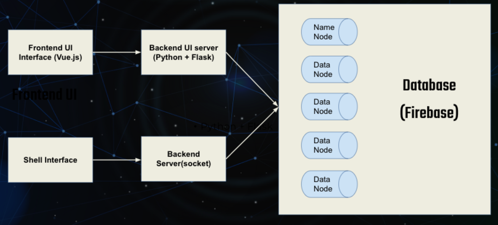
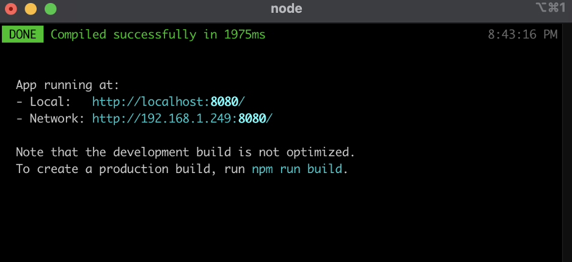
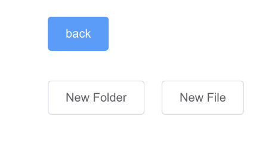

# HDFS-Emulation

## Decription:

The architecture of the system is shown below:
* Use Vue.js to implement frontend UI interface.
* Use Python and Flask to connect the frontend page with the backend database. 
* The system can also accept shell commands in the terminal using sockets. 

## Configuration:

### Running frontend code:

If you want to run our front-end code written in vue.js, you need the following requirements:
1.	Installed Node.js on you machine and download our code
2.	Run the backend server: edfs.py
3.	Go to the directory named “hdfs-frontend” under “UI” directory on your machine and start a terminal here
4.	Run the following code in the command line:
npm run serve
There might be some warnings coming up, just click on cancel and ignore them. The you should be able to see something like this in your terminal:

Then open your browser (better be chrome) and go to the local url shown inside the terminal. You should see the initial UI like this:

You should be able to interact with the frontend now.

### Running socket server-client interaction:

1.	Find server.py and client.py inside socket directory
2.	You should have server code running at first, and then run client code using following format:
python3 client.py <your command>
Command supported:
	-ls <directory path>
	-mkdir <directory path>
	-rmdir <directory path>
	-put <file name with path> <file destination path>
	-cat <file name with path>
-get <file name with path> <file name destination path>
-rm <file name with path>
Sample command:
python3 client.py -mkdir /dir1

python3 client.py -mkdir /dir2

python3 client.py -rmdir /dir2

python3 client.py -put /pre1.json /dir1

python3 client.py -ls /

python3 client.py -ls /dir1

python3 client.py -cat /dir1/pre1.json

python3 client.py -get dir1/pre1.json /pre1.json

python3 client.py -rm /dir1/pre1.json

If you'd like to run your own file system, please mofify the url under edfs.py to your own Firebase url.

## Presentation:

A video of how the system works has been uploaded to YouTube: https://www.youtube.com/watch?v=SLGoAuBmRKc
